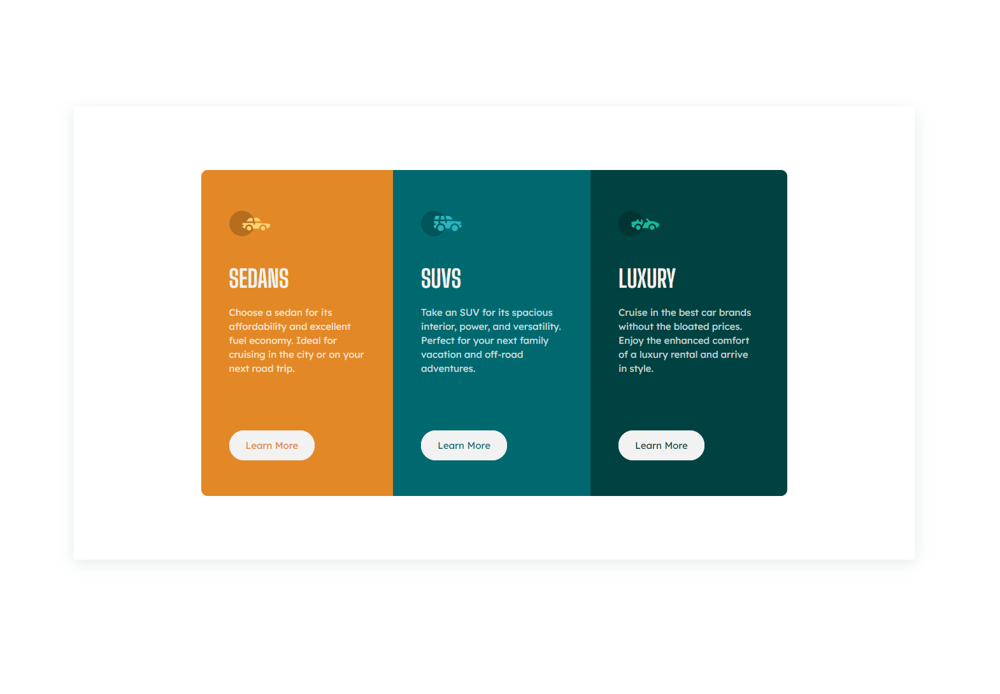

# Frontend Mentor - 3-column preview card component solution

This is a solution to the [3-column preview card component challenge on Frontend Mentor](https://www.frontendmentor.io/challenges/3column-preview-card-component-pH92eAR2-). Frontend Mentor challenges help you improve your coding skills by building realistic projects. 

## Table of contents

- [Overview](#overview)
  - [The challenge](#the-challenge)
  - [Screenshot](#screenshot)
  - [Links](#links)
- [My process](#my-process)
  - [Built with](#built-with)
  - [What I learned](#what-i-learned)

## Overview

### The challenge

Users should be able to:

- View the optimal layout depending on their device's screen size
- See hover states for interactive elements

### Screenshot

### Links
- Live Site URL: [View Live](https://mohammedbasheerabbas.github.io/frontendmentor/)

## My process

Just used simple flexbox layout to put the columns together

### Built with

- HTML
- CSS
- Flexbox
- CSS Grid

### What I learned

It was a great refresher on laying out a simple columns layout using html and css. I got more comfortable with Flexbox too. 

